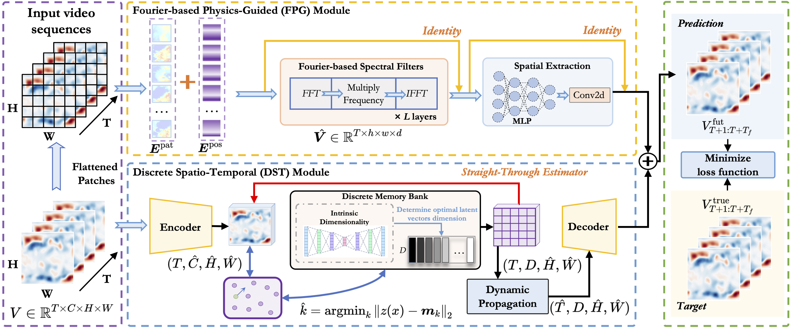

# PastNet: Introducing Physical Inductive Biases for Spatio-temporal Video Prediction (ACMMM2024)


## Abstract

In this paper, we investigate the challenge of spatio-temporal video prediction, which involves generating future videos based on historical data streams. Existing approaches typically utilize external information such as semantic maps to enhance video prediction, which often neglect the inherent physical knowledge embedded within videos. Furthermore, their high computational demands could impede their applications for high-resolution videos. To address these constraints, we introduce a novel approach called **Physics-assisted Spatio-temporal Network (PastNet)** for generating high-quality video prediction. The core of our PastNet lies in incorporating a spectral convolution operator in the Fourier domain, which efficiently introduces inductive biases from the underlying physical laws. Additionally, we employ a memory bank with the estimated intrinsic dimensionality to discretize local features during the processing of complex spatio-temporal signals, thereby reducing computational costs and facilitating efficient high-resolution video prediction. Extensive experiments on various widely-used datasets demonstrate the effectiveness and efficiency of the proposed PastNet compared with a range of state-of-the-art methods, particularly in high-resolution scenarios.


<p align="center" width="100%">
  
</p>


## Overview

* `API/` contains dataloaders and metrics.
* `modules/` contains several used module blocks.
* `models/` contains the PastNet model.
* `train_model.py` is the core file for training, validating, and testing pipelines.


## Citation

If you are interested in our repository and our paper, please cite the following paper:

```
@inproceedings{wu2024pastnet,
  title={Pastnet: Introducing physical inductive biases for spatio-temporal video prediction},
  author={Wu, Hao and Xu, Fan and Chen, Chong and Hua, Xian-Sheng and Luo, Xiao and Wang, Haixin},
  booktitle={Proceedings of the 32nd ACM International Conference on Multimedia},
  pages={2917--2926},
  year={2024}
}
```

